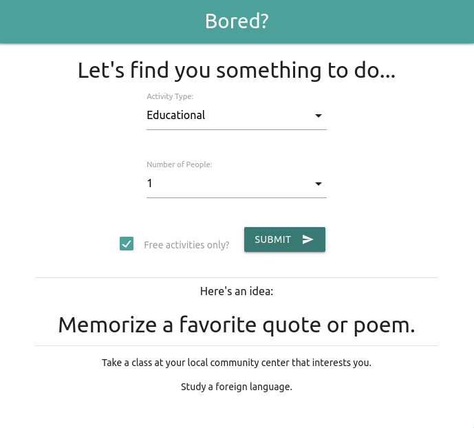

---

# Bored?

## Overview

The _Bored?_ application utilizes the [Bored Api](https://boredapi.com) to suggest ideas to combat boredom. A user can select an activity type, the number of people to participate and if the activity is free or not.

### Features

The _Bored?_ application contains the following features:

- User selectable search criteria
  - Activity Type selector
  - Number of people selector
  - Free activities checkbox
- Large text string that prominently displays the currently suggested activity.
- If a link is provided by the API, the currently suggested activity will be presented as a hyperlink.
- Activity history list (up to 5 recently displayed activities).
- Clear button will remove all activity items shown in the history list.
- Alert message when current search criteria returns no activities from the API.

## Installation

The _Bored?_ application requires no installation. It simply needs to be downloaded and opened as follows:

1. Clone this repo to your computer.
2. Open index.html in your browser.

## Usage

1. Select an activity type from the **Activity Type** drop down menu ("Any" is the default selection).
2. Select the number of people that will be participating in this activity from the **Number of People** drop down menu ("Any" is the default selection).
3. Select whether you would like to be shown free events or paid events with the **Free activities only?** checkbox.
4. Click the **Submit** button.
5. To clear the history list, click the **Clear** button (only displayed when the history list is populated with at least one activity).
